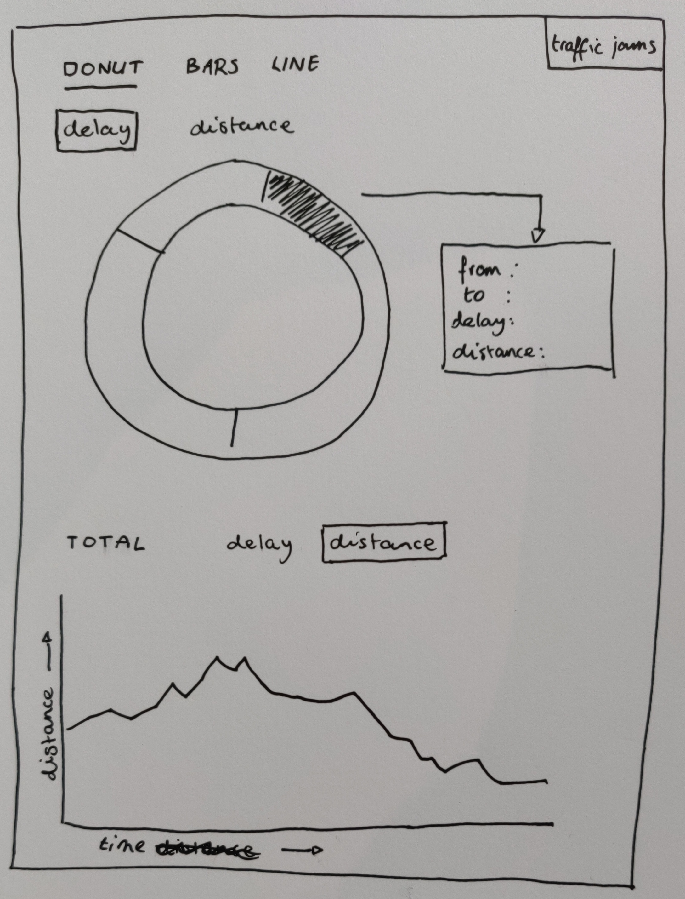
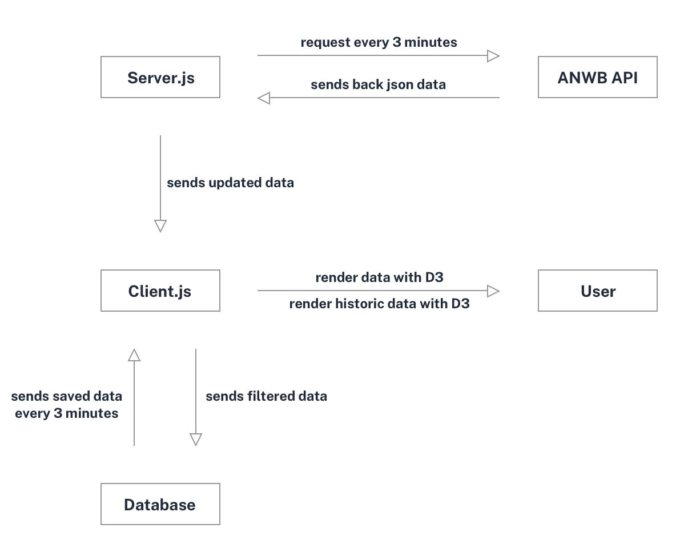

<div align="center">
	<h1 align='center'>Real-time Web</h1>
<!-- 	 -->
</div>
<p align="center">
	Real-time web application with AWNB API.
	<br>
	<!-- <a href="#">Live demo</a> -->
</p>
<br>

## Table of contents

- [Install](#install)
- [Concept](#concept)
- [API](#api)
- [Status](#status)
- [Feedback](#feedback)
- [Sources](#sources)

## Install

You have to need [Node.js](https://nodejs.org/en/download/) installed on your computer to run this project. To install this project on your computer, please follow the steps below from your command line:

```shell
# Clone repository
git clone https://github.com/peppequint/real-time-web-1819.git

# Go to the repository
cd real-time-web-1819

# Install dependencies
npm install

# Server + file changes are detected
npm run dev
```

## Concept

Approximately two million people travel by car every working day during rush hour in the Netherlands. ANWB provides access to data of traffic jams. With this concept I want to show an overview of daily traffic jams. What is the total distance of all the traffic jams together? And what is the difference between the days of the week?

### Interaction

With D3 it is possible to show the results in different charts. The user can select the different charts at the top. That is the current situation on the roads.

The total length of the traffic jams is indicated on the y-axis and the time of the day on the x-axis.



### Data life cycle

This overview shows the data life cycle of this application.



## API

This application uses the data from the ANWB API.

### API data

Beneath is the data that the ANWB API provides. This example is one road, the A1. As you can see it is too much data that won't be used. And it's all about traffic jams.

```json
{
  "road": "A1",
  "roadType": "aWegen",
  "events": {
    "trafficJams": [
      {
        "msgNr": "178135885",
        "from": "Baarn",
        "fromLoc": { "lat": 52.22059, "lon": 5.29914 },
        "to": "Barneveld",
        "toLoc": { "lat": 52.16757, "lon": 5.56571 },
        "location": "A1 Amsterdam richting Apeldoorn",
        "segStart": "Amsterdam",
        "segEnd": "Apeldoorn",
        "start": "2019-04-18T12:52:00",
        "startDate": "18 April 2019 14:52 uur",
        "delay": 1080,
        "distance": 11200,
        "reason": "",
        "description": "Tussen Baarn en Barneveld. ",
        "events": [{ "alertC": "101", "text": "Stilstaand verkeer" }]
      },
      {
        "msgNr": "178136110",
        "from": "Hoevelaken",
        "fromLoc": { "lat": 52.17043, "lon": 5.43905 },
        "to": "Voorthuizen",
        "toLoc": { "lat": 52.16876, "lon": 5.59499 },
        "location": "A1 Amsterdam richting Apeldoorn",
        "segStart": "Amsterdam",
        "segEnd": "Apeldoorn",
        "start": "2019-04-18T14:20:30",
        "startDate": "18 April 2019 16:20 uur",
        "delay": 180,
        "distance": 2900,
        "reason": "",
        "description": "Tussen Hoevelaken en Voorthuizen. ",
        "events": [
          { "alertC": "108", "text": "Langzaam rijdend tot stilstaand verkeer" }
        ]
      },
      {
        "msgNr": "178135966",
        "from": "knp. Beekbergen",
        "fromLoc": { "lat": 52.18794, "lon": 6.02277 },
        "to": "Twello",
        "toLoc": { "lat": 52.21768, "lon": 6.12511 },
        "location": "A1 Apeldoorn richting Hengelo",
        "segStart": "Apeldoorn",
        "segEnd": "Hengelo",
        "start": "2019-04-18T06:18:00",
        "startDate": "18 April 2019 08:18 uur",
        "delay": 300,
        "distance": 4700,
        "reason": "",
        "description": "Tussen knp. Beekbergen enTwello. ",
        "events": [
          { "alertC": "108", "text": "Langzaam rijdend tot stilstaand verkeer" }
        ]
      },
      {
        "msgNr": "178135948",
        "from": "Twello",
        "fromLoc": { "lat": 52.21768, "lon": 6.12511 },
        "to": "Bathmen",
        "toLoc": { "lat": 52.24305, "lon": 6.30979 },
        "location": "A1 Apeldoorn richting Hengelo",
        "segStart": "Apeldoorn",
        "segEnd": "Hengelo",
        "start": "2019-04-18T06:18:00",
        "startDate": "18 April 2019 08:18 uur",
        "delay": 420,
        "distance": 4900,
        "reason": "",
        "description": "Tussen Twello en Bathmen. ",
        "events": [
          { "alertC": "108", "text": "Langzaam rijdend tot stilstaand verkeer" }
        ]
      }
    ],
    "roadWorks": [],
    "radars": []
  }
}
```

This example also shows one road. But much less data and only data that is needed. There is also data of road works and speed controls (if this is the case).

```json
{
  "road": "A76",
  "events": {
    "traffic": {
      "from": "knp. Kerensheide",
      "to": "Nuth",
      "delay": 300,
      "distance": 6600
    },
    "work": {
      "from": "Spaubeek",
      "to": "Nuth",
      "reason": "Wegwerkzaamheden. Van 25 september 2018 05:30 uur tot 15 juni 2019 21:00 uur."
    },
    "radar": {
      "from": "Nuth",
      "to": "Schinnen",
      "reason": "bij hectometerpaal 10,9."
    }
  }
}
```

## Status

- [ ] Update data life cycle
- [ ] Make simple UI as a start
- [ ] Implement D3 charts
- [ ] Data needs to be updated real-time

## Feedback

I would like to have feedback of the data life cycle overview. I have not yet used visual colours to clarify this chart.

## Sources

- [ANWB Data](https://www.anwb.nl/feeds/gethf)
